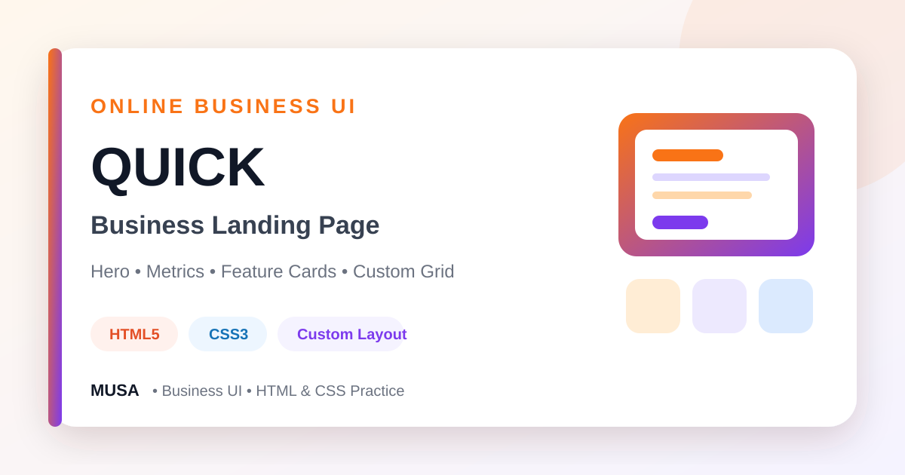

<div align="center">



# Quick — Online Business Landing Page

### A clean static landing page for an online-business concept, created with HTML5, custom CSS, Google Fonts, and reusable grid classes.


[](https://github.com/samusa099)
[](https://developer.mozilla.org/docs/Web/HTML)
[](https://developer.mozilla.org/docs/Web/CSS)

[](https://github.com/samusa099/Assignments_04)
[](https://github.com/samusa099/Assignments_04)
[](https://github.com/samusa099/Assignments_04/commits/main)

</div>

---

## 📌 Overview

A custom-CSS business landing page featuring a branded header, hero illustration, success metrics, reusable feature cards, and a clean footer.

## 📚 Documentation

| Resource | Description |
|---|---|
| [**HOW_TO_USE.md**](HOW_TO_USE.md) | Why, where, and how to study, customise, extend, and publish the project |
| [**Repository Cover**](assets/repository-cover.svg) | Scalable professional cover used in this README |

## ✨ Key Features

- Header with logo and navigation
- Business-focused hero section
- Project-success statistics block
- Three illustrated feature cards
- Reusable custom grid and spacing system
- Simple branded footer

## 🛠️ Technology Stack

| Technology | Purpose |
|---|---|
| HTML5 | Page structure and content |
| CSS3 | Custom grid, styling, spacing, and typography |
| Google Fonts | Project typography |

## 🗂️ Repository Structure

```text
Assignments_04/
├── index.html
├── css/
├── images/
├── assets/
│   └── repository-cover.svg
├── HOW_TO_USE.md
└── README.md
```

## 🚀 Run Locally

```bash
git clone https://github.com/samusa099/Assignments_04.git
cd Assignments_04
```

Open `index.html` in a browser or use **VS Code Live Server**.

> Navigation and business content are static placeholders until connected to real pages or services.

## 👤 Author

<div align="center">

### Musa

**Internationally certified HR professional and data analytics practitioner from Bangladesh.**  
Musa combines people operations, Excel, Power BI, SQL, and technology-driven problem-solving to build practical, structured, and user-focused projects.

[](https://github.com/samusa099)

</div>
